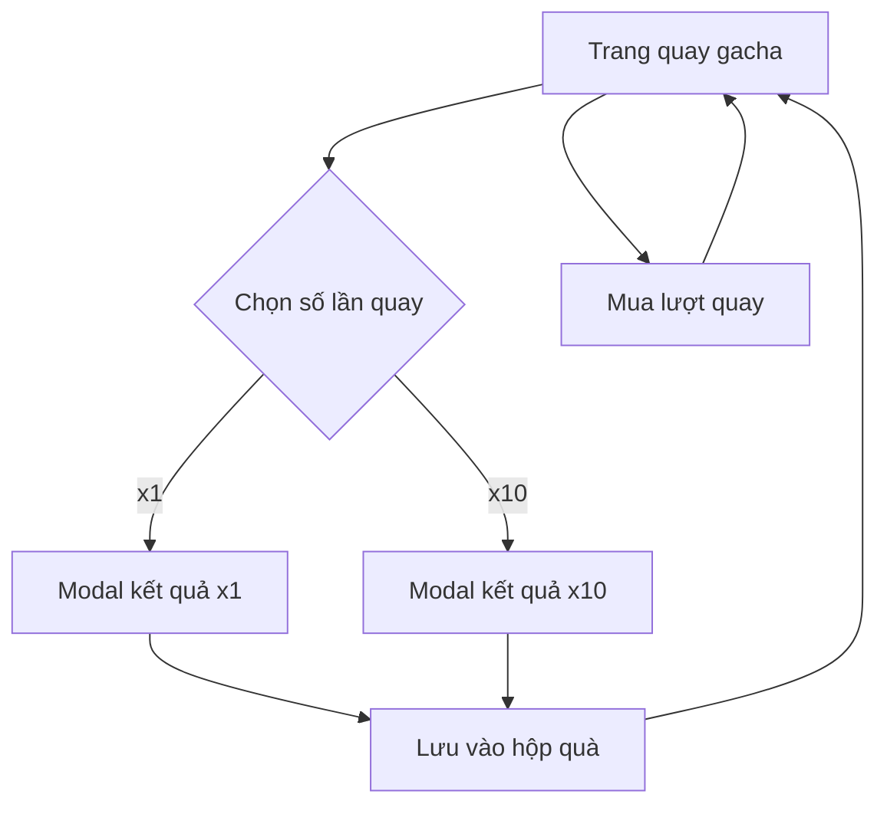

## 1. Tổng quan sản phẩm
Website gacha item với hệ thống quay thưởng theo tỷ lệ xác định, cho phép người dùng mua lượt quay và thu thập vật phẩm vào hộp quà. Sản phẩm hướng đến người dùng yêu thích game online và hệ thống quay thưởng may rủi.

## 2. Tính năng cốt lõi

### 2.1 Vai trò người dùng
| Vai trò | Phương thức đăng ký | Quyền hạn cốt lõi |
|---------|---------------------|------------------|
| Người dùng thường | Email/SĐT | Quay gacha, mua lượt, xem hộp quà |

### 2.2 Module tính năng
Website gacha bao gồm các trang chính sau:
1. **Trang quay gacha chính**: Hiển thị pool vật phẩm, nút quay x1 và x10, số dư lượt quay.
2. **Modal kết quả x1**: Hiển thị vật phẩm trúng thưởng khi quay 1 lần.
3. **Modal kết quả x10**: Hiển thị 10 vật phẩm trúng thưởng dạng lưới.
4. **Trang hộp quà**: Lưu trữ và hiển thị tất cả vật phẩm đã quay được.

### 2.3 Chi tiết từng trang
| Tên trang | Module chính | Mô tả tính năng |
|-----------|-------------|------------------|
| Trang quay gacha chính | Pool vật phẩm | Hiển thị 9 vật phẩm chính với hình tròn, tên và huy hiệu (首发, 不可交易, v.v.) |
| Trang quay gacha chính | Nút quay thưởng | Nút "Quay 1 lần" màu vàng, nút "Quay 10 lần" màu đỏ cam |
| Trang quay gacha chính | Thông tin lượt | Hiển thị "残余钥匙：0" và checkbox tùy chọn hiển thị popup |
| Trang quay gacha chính | Mua lượt quay | 2 nút mua 10 lượt và 50 lượt, cộng vào số dư hiện tại |
| Modal kết quả x1 | Header | Hiển thị "恭喜获得" với nền tím gradient |
| Modal kết quả x1 | Vật phẩm | Hiển thị tên và hình ảnh vật phẩm trúng thưởng |
| Modal kết quả x1 | Nút hành động | Nút "炫耀一下" màu đỏ cam, nút "返回抽奖结果" |
| Modal kết quả x10 | Header | Hiển thị "恭喜您获得" và cảnh báo không refresh trang |
| Modal kết quả x10 | Lưới kết quả | Hiển thị 10 vật phẩm trong ô màu xanh với tên và số lượng |
| Modal kết quả x10 | Footer | Thông báo gửi vật phẩm trong 24h và có thể bị delay |
| Trang hộp quà | Danh sách vật phẩm | Hiển thị tất cả vật phẩm đã quay được với số lượng |

## 3. Luồng hoạt động chính
Người dùng truy cập trang quay gacha → Xem pool vật phẩm và tỷ lệ → Chọn mua lượt quay (10 hoặc 50) → Click nút quay x1 hoặc x10 → Xem kết quả trong modal → Vật phẩm được lưu vào hộp quà tự động.

## 4. Thiết kế giao diện

### 4.1 Phong cách thiết kế
- **Màu chủ đạo**: Vàng đồng, cam đỏ, nền gradient ấm áp
- **Màu phụ**: Tím (cho modal), xanh dương nhạt (cho ô kết quả)
- **Phong cách nút**: 3D có viền vàng, hiệu ứng glow bên trong
- **Font chữ**: Sans-serif hiện đại, kích thước 14-18px cho nội dung chính
- **Bố cục**: Card-based với khung viền trang trí hình ngọn lửa
- **Icon**: Sử dụng emoji vàng, cam phù hợp với chủ đề game

### 4.2 Tổng quan thiết kế từng trang
| Tên trang | Module chính | Thiết kế UI |
|-----------|-------------|-------------|
| Trang quay gacha | Pool vật phẩm | 9 hình tròn xếp thành 3 hàng, nền gradient vàng be, chữ nâu cam |
| Trang quay gacha | Nút quay thưởng | Nút 3D có viền vàng, bên trái màu vàng, bên phải màu đỏ cam |
| Modal x1 | Card kết quả | Nền tím gradient, góc trang trí, nút đỏ cam có viền vàng |
| Modal x10 | Lưới kết quả | 10 ô màu xanh tròn góc, nền modal cam be có họa tiết ngọn lửa |

### 4.3 Responsive
Thiết kế ưu tiên desktop-first, tự động thích ứng với mobile với bố cục cột đơn cho màn hình nhỏ.

## 5. Hệ thống tỷ lệ
Pool vật phẩm với tỷ lệ quay như sau:
- Vật phẩm cao cấp (0.01%-0.6%): 神威核心x1, 神威天煞, 神威莲华, 烈芒蝶刃, v.v.
- Vật phẩm trung cấp (1%-5%): 王者之石x10, 随机CF点宝箱, 神威卡x1
- Vật phẩm thường (39%): 道具卡x1, 金马卡x1
- CF点宝箱 có tỷ lệ phụ: 18000 CF点 (10%), 8000 CF点 (20%), 5000 CF点 (30%), 3000 CF点 (40%)